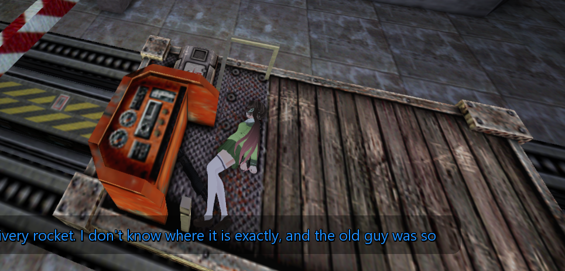
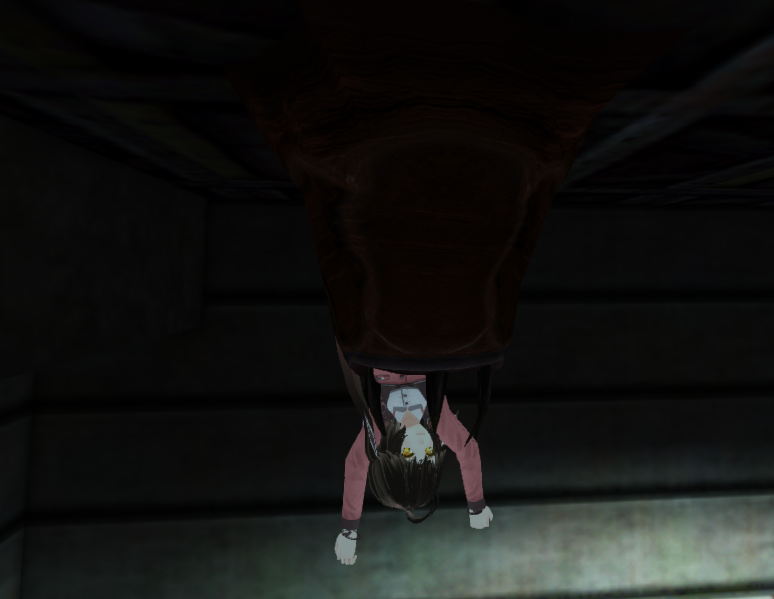

# BulletPhysics documentation

[Back to README](../../README.md) | [中文文档](../zh-CN/features.md)

### Features

1. Transform player model into ragdoll when player is dead

2. Transform player model into ragdoll when player is being caught by barnacle or gargantua (thirdperson only for local player).

3. Brush entities can interact with ragdoll.

4. Water can interact with ragdoll if section `[WaterControl]` is specified in the ragdoll config.

5. Jiggle Bones





### Compatibility

The source targets GoldSrc and SvEngine families. Current catalog coverage,
legacy client-data limits and installation requirements are described in
[Installation](installation.md). The two Sven identities have different optional
view-entity slots; 8948 does not publish the 10257 slot.

### Console Vars

| Variable | Default | Purpose |
| --- | --- | --- |
| `bv_simrate` | 64 | Simulation frequency, clamped to 32–128 |
| `bv_syncview` | 1 | Physics camera synchronization |
| `bv_force_updatebones` | 1 | Force bone updates |
| `bv_debug_draw` | 0 | Enable physics debug drawing |
| `bv_debug_draw_wallhack` | 0 | Draw through walls |
| `bv_debug_draw_level_*` | 1 | Filter static/dynamic/ragdoll/rigidbody/constraint/behavior drawing |

With cheats allowed and the VGUI2Extension UI available, `bv_open_debug_ui` opens
the editor. `bv_reload_all`, `bv_reload_objects`, `bv_reload_configs` and
`bv_save_configs` manage configurations and objects.

### Current physics configurations

The plugin first loads `<model>_physics.txt` (KeyValues), then falls back to the
legacy `<model>_ragdoll.txt`. A migrated KeyValues example is
[GFL_M14_physics.txt](../../assets/svencoop_downloads/models/player/GFL_M14/GFL_M14_physics.txt).
The debug editor can save configurations; corresponding model files must be installed separately.
The remaining sections document the legacy ragdoll format.

### How to make ragdolls

1. You have to create a file named `[model_name]_ragdoll.txt` at `\Sven Co-op\steamapps\common\Sven Co-op\svencoop(_addons, _download etc)\models\[model_name]\`, for example `\Sven Co-op\svencoop_addon\models\player\GFL_M14\GFL_M14_ragdoll.txt`. (The model is from https://gamebanana.com/mods/167065)

2. The content of "[model_name]_ragdoll.txt" should follow the format :

* [Legacy example: GI_Ganyu_ragdoll.txt](../../assets/svencoop_downloads/models/player/GI_Ganyu/GI_Ganyu_ragdoll.txt).

* Monsters follow the same instruction.

#### [DeathAnim]

The section 'DeathAnim" defines when to transform player or monster into ragdoll. 

##### Example line : 12 120

"12" for the sequence number of death animation

"120" for which frame to transform corpse of dead player into ragdoll if this sequence of animation is playing. range : 0 ~ 255

** This is 255-based, you need to convert the frame number you saw in model viewer into (framenumber * 255 / maxframes)

** While the specified sequence number of death animation is playing, and after the certain frame, the corpse of dead player is transformed into ragdoll. **

** Only sequence with "DIE_" prefixed activity will be treated as death anim.

You can check each sequence of animation using HLMV or [HLAM](https://github.com/SamVanheer/HalfLifeAssetManager)

#### [RigidBody]

The section "RigidBody" creates basic rigidbodies for ragdoll.

##### Example line : Head   15  6  sphere  -4.0   5.0  0.0   6

"Head" for internal name of rigidbody. ** Warning : space or special characters are not allowed !

"15" for the index of bone which is bound to rigidbody

"6" for the index of bone which is being looked at by rigidbody

"sphere" for shape of rigidbone, either sphere or capsule.

"-4.0" for rigidbody offset from current bone origin (it's the bone with index 15 here)

"5.0" for size of rigidbody, it's "width" for capsule, and "radius" for sphere

"0.0" for size2 of rigidbody, it's "height" for capsule

"6" for rigidbody mass. rigidbody with smaller mass is easier to be dragged by rigidbody with bigger mass.

** The example line creates a rigidbody named "Head" at position of bone[15], with an offset of "-4.0" to the bone[6]. and the size of sphere rigidbody is 5.0 **

Inspect bone indices with HLMV or [HLAM](https://github.com/SamVanheer/HalfLifeAssetManager), then use `bv_debug_draw 1` to inspect the configured physics shapes.

** Make sure _ragdoll.txt is in the correct location if you got nothing in the console.**

#### [Constraint]

The section "Constraint" controls how to bind rigidbodies together.

##### Example line : Spine  Head   conetwist 6 15   0 6 0     0  0 -5.5      0.05 0.05 0.2

"Head" for the name of rigidbody to controll

"Spine" for the name of another rigidbody to controll

"conetwist" for type of constraint, point or conetwist or hinge.

"6" for bone index to calculate origin offset from center of "Head"

"15" for bone index 2 to calculate origin offset from center of "Spine"

"0" "6" "0" for local offset X, Y, Z from origin of bone[6]

"0" "0" "-5.5" for local offset X, Y, Z from origin of bone[15]

"0.05" "0.05" "0.2" for factors of current constraint.

** The example line creates a "conetwist" constraint for rigidbodies named "Head" and "Spine", swingSpan1 limits to PI (3.141593) multiplies 0.05, swingSpan2 limits to PI (3.141593) multiplies 0.05, twistSpan limits to PI (3.141593) multiplies 0.2 **

#### [Barnacle]

The section "Barnacle" controls how barnacle interact with ragdollized players.

##### Example line : LLeg2   dof6     0  8  0     40000    4  16

"LLeg2" for the name of rigidbody to controll

"dof6" for type of constraint( dof6 / slider ) or chew (which will apply a force every X seconds).

"0" "8" "0" for local offset X, Y, Z from origin of LLeg2

"40000" for magnitude of force to pull ragdoll up.

"4" for final height (Z axis) offset of rigidbody height limit in GoldSrc world.

"16" for initial height (Z axis) offset to "4", the initial offset is 4 - 16 = -12

** This example line creates a "dof6" constraint for "LLeg2", pulling "LLeg2" up with a power/force of 40000 N. "LLeg2" can go up to (barnacle.z - 12) at initial. **

##### Example line : Pelvis  chewforce     0  0  0     8000     1.0  0

"Pelvis" for the name of rigidbody to apply impulse on

"0" "0" "0" for local offset X, Y, Z from origin of Pelvis, aka center.

"8000" for magnitude of impulse to pull ragdoll up.

"1.0" for every 1 second the Pelvis is applied a impulse of 5000 unit.

0 for nothing.

** This example line applies an impulse force of 8000 to "Pelvis" every 1 second only when barnacle is chewing. **

** Warning : there must be a rigidbody named "Pelvis" to get barnacle-ragdoll work correctly. **

##### Example line : LLeg2  chewlimit     0  0  0     0     1.0  3

"LLeg2" for the name of rigidbody to raise up the Z limit.

"0" "0" "0" for nothing.

"0" for nothing.

"1.0"  "3" for every 1 second the Pelvis's Z axis limit is raised up by 3.

** This example line raise the Z axis limit up 3 units for "Pelvis" every 1 second in GoldSrc world. **

** Warning : there must be a rigidbody named "Pelvis" to get barnacle-ragdoll work correctly. **

##### Full example :

```
[Barnacle]
LLeg2   dof6          0  8  0     40000   4   16
LLeg2   chewlimit     0  0  0     0       1.0  4
RLeg    dof6          0  0  0     30000  -16  16
RLeg    chewlimit     0  0  0     0       1.0  4
Pelvis  chewforce     0  0  0     8000    1.0  0
```

#### [WaterControl]

The section "WaterControl" controls how water interact with ragdollized players and monsters, basically resistance and buoyancy force.

##### Example line : Head    0  0  0    0.95  0.5  0

`Head` is the internal name of the rigidbody that interact with water.

`0 0 0` means the water detector of rigidbody is at 0 0 0 of it's local coordinate system, buoyancy force is applied when this point touches water (or inside water)

`0.95` means the rigidbody get 95% of it's gravity as buoyancy force that push it upward when touch water.

`0.5` is damping that stops the rigidbody from rotating or moving inside water

`0` does nothing and is reserved for future use

*** Multiple detecting point can be added for one rigidbody

##### Full example :

```
[WaterControl]
Head    0  0  0    0.95  0.5  0
Spine   0  0  0    0.95  0.5  0
Pelvis  0  0  0    0.95  0.5  0

LArm    0  0  0    0.95  0.5  0
LArm2   0  0  0    0.95  0.5  0
LHand   0  0  0    0.95  0.5  0

RArm    0  0  0    0.95  0.5  0
RArm2   0  0  0    0.95  0.5  0
RHand   0  0  0    0.95  0.5  0

LLeg    0  0  0    0.475 0.5  0
LLeg    8  0  0    0.475 0.5  0
LLeg2   0  0  0    0.475 0.5  0
LLeg2   10 0  0    0.475 0.5  0

RLeg    0  0  0    0.475 0.5  0
RLeg    8  0  0    0.475 0.5  0
RLeg2   0  0  0    0.475 0.5  0
RLeg2   10 0  0    0.475 0.5  0

FakehairL1    0 0 0    0.95  0.5  0
FakehairL2    0 0 0    0.95  0.5  0
FakehairL3    0 0 0    0.95  0.5  0
FakehairR1    0 0 0    0.95  0.5  0
FakehairR2    0 0 0    0.95  0.5  0
FakehairR3    0 0 0    0.95  0.5  0
```
